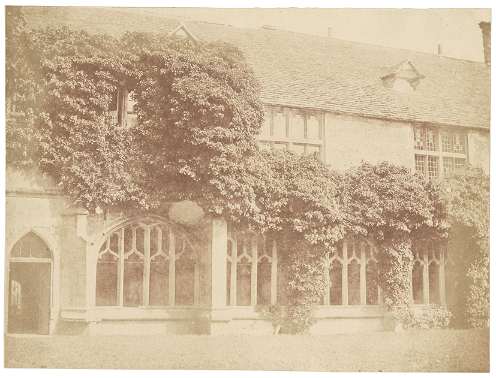
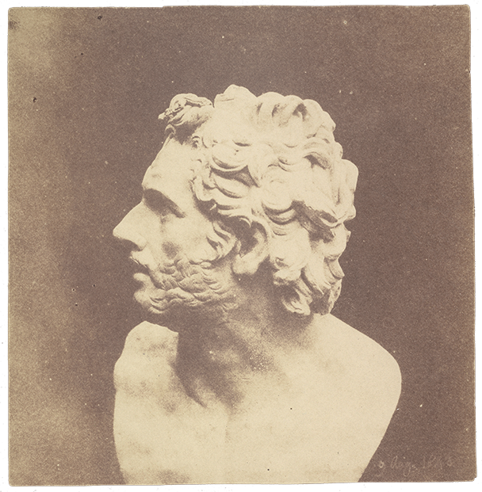

Let’s return for a moment to February 1, 1839, and the afternoon of
Talbot’s visit to Slough to show Herschel his “specimens.” Although the
winter weather was miserable, 1839 was shaping up to be an interesting
time for an English gentleman of leisure with solid financial resources.
A new and young queen was on the throne; the empire was expanding;
change was in the air. Despite the economy’s having slowed in recent
years, trade and travel had been energized in the late 1830s due in part
to new and more time-efficient modes of transportation such as
steamboats and the railroad. Interest rates were rising, though soon the
government would cut them, leading to increased investment in more
profitable private railway futures. There was no sign yet of the
overheated market of the mid-1840s that would lead to the collapse of
the railway bubble and widespread financial ruin for thousands.
Politically as well as financially, it was a time of reform and change —
and of dissent regarding those changes and resistance to many of them.
The previous year, the Chartist movement had failed in its lobbying
effort to extend voting rights to all males and for annual elections to
be held for the House of Commons, though those changes were eventually
to be made later in the century. Talbot himself was a moderate reformer,
largely sympathetic to the Whig party, and had served as a member of
Parliament for Chippenham between 1832 and 1835, so if he had picked up
a newspaper to read on the train, he might have been interested in
following that day’s political events.

He certainly had a far greater choice among publications than ever
before, as reduced tariffs on stamps and paper continued to lower the
production costs of daily publications. We know that he was a regular
reader of weeklies such as the *Literary Gazette* and the *Athenaeum*.
For daily news coverage, however, he would likely have had a copy of the
*Times*, a newspaper that began circulating in 1785 as the *Daily
Universal Register*. If he had the paper with him on the ride to Slough,
he might well have been following the stories it contained on some of
those reforms that had been pushed through earlier in the decade during
his tenure in Parliament.

There was plenty of political interest to read about that particular
day, including an account of the consequences of the new Poor Law as
well as an article about a recent gathering of concerned parties to
discuss the state of the current Corn Laws. There was a lengthy piece on
the coal trade, with an account of a recent dinner hosted by the
Newcastle chamber of commerce, attended by the mayor, several members of
Parliament, and various wealthy owners and investors. Talbot might also
have been interested in reading about a “curious telegraphic
system”[^16] tried out the previous
week in Paris, or about Queen Victoria’s recent private visit to the
theater at Drury Lane to see the famous American wild-animal trainer,
Mr. Van Amburgh, feed his animals on the stage. In the London law
courts, owners of premises in Lower Thames Street were petitioning
against extending the Blackwall railway as far as Fenchurch Street,
while the *Monthly Chronicle* was bringing a copyright suit against a
new magazine, the *Railway Times,* over an article published the month
before. Over at the Admiralty, the court was considering the case of the
*Aline*, a Russian schooner with a cargo of flax, which had collided in
the channel with the *Panther*, a brig with a cargo of oil sailing from
Gallipoli to Saint Petersburg.

The financial news that day was good: there was “no fluctuation of any
consequence in the funds,” and railway shares were stable; news of the
failure of some cotton houses in Manchester had apparently not affected
the wider market. Cotton prices in Liverpool were “without change
… mostly steady.” In the classifieds, the China Tea Company was
reducing its prices, as was the East India Tea Company; coal remained
steady, between twenty-nine and thirty shillings a ton. Textiles from
the northern mills, as well as imported linens and general haberdashery,
were on offer: “Moravian, Trafalgar and French embroidery cottons” along
with “knitting and netting cottons, Taylor’s Persian thread on reels,
netting silks, Berlin patterns and wools.”

If Talbot looked at the births and deaths that day, he might not have
noticed, as a twenty-first-century reader does, the relative youth of
those who had just died, or that the cause of death of the
sixteen-year-old daughter of the American consul in London was
consumption, a disease that would become familiar to the post-Victorian
world largely through the pages of novels that were mostly yet to be
written. There is no mention of Dickens in the *Times* that day, though
he was well known by 1839 and already feeling decidedly overextended. He
had published *Oliver Twist* the year before, and with too many writing
commitments on his desk, had decided just that past Monday to resign his
editorship at *Bentley’s Miscellany* in order to finish up *Nicholas
Nickleby* and make some progress with *Barnaby Rudge* (for which he had
to beg a six-month extension). Dickens’s future literary rival William
Thackeray was working as a lowly reviewer for the *Times*, but in that
day’s book column the focus was not on fiction but on the just-released
twelfth volume of the Duke of Wellington’s dispatches, allowing the
anonymous reviewer (Thackeray?) to indulge in some unabashed hero
worship. Wellington (pl. 9) was for many Victorians the embodiment of
glorious military history, and he provided a living link between the
modern age and what was beginning to feel like the distant past of the
Napoleonic Wars. Jane Austen was long dead. The Battle of Waterloo, to
be fictionalized later by Thackeray in his best-selling historical novel
*Vanity Fair*, already seemed to belong to another age.

Maybe Talbot skipped the book review to look at the society pages: the
Duke of Cambridge had gone to Kew Park the day before for a day’s
shooting; Viscount Melbourne and Lord Hill had held audiences with the
queen. Charles Darwin’s marriage earlier in the week did not make the
news that day, though in 1839 his name probably didn’t ring much of a
bell for Talbot. Paul Cézanne had also just been born, though Talbot
wouldn’t have seen that particular birth announcement in the *Times*,
any more than he would have paid attention to the birth later that year
of Walter Pater, future aesthete and literary role model for the future
Oscar Wilde. In April 1839, just two months away, the world’s first
commercial electric telegraph line would come into operation. In July,
slaves aboard the *Amistad* would rebel and capture the ship. Also in
July of that year, the First Anglo-Afghan War would begin, as would, in
September, the first Anglo-Chinese Opium War.

Of course, it’s possible that Talbot did not read the newspaper at all,
but rather looked out the window and experienced the novelty of the
train ride. The public railway had been founded in 1825 and only very
recently connected London with that part of Buckinghamshire where
Herschel lived. The countryside, it seemed, was getting closer to town.
One might now make in an hour a journey that had previously taken half a
day or more; for the first time, one could, as Talbot did that
afternoon, run down to Slough, stay for dinner, and return to London by
train the same day. The speed with which it was possible to move through
space on land and sea meant that distances were in effect getting
smaller. By 1852 the travel time between London and Scotland would
lessen so significantly that Queen Victoria could regard the Highlands
as a holiday destination and purchase a residence there.

Whereas the reach of empire was expanding, as the many newspaper notices
of docking and departing ships attested, it *felt* as though
geographical distances were shrinking and the rest of the world was
coming closer.

On a grander scale, through refinements in the telescope during the
eighteenth century, previously unknown star clusters were being
cataloged, and the 1830s (1839 in particular) saw fierce competition
among astronomers to calculate with greater precision interstellar
distances. Scientific achievement had never seemed more extraordinary
or, literally, so far-reaching. At the same time, geological theories
concerning the age of the world and the circumstances of its coming into
being rendered human beings ever smaller in the history of the cosmos.
The vastness of the universe in time and space challenged the religious
and philosophical certainties of many nineteenth-century minds.

One who had already made a contribution to the conceptual shrinking of
space, by building a new kind of telescope in 1816, was John Herschel.
In January 1839, as his letters to Talbot suggest, he was suffering from
the dreariness of the English winter weather after having spent the
previous five years in South Africa charting the night sky of the
Southern Hemisphere. When Herschel returned to England in 1838, he
received a baronetcy for his contributions to human knowledge and
settled comfortably back into the life of an educated gentleman with
scientific interests. When Talbot visited him in Slough that Friday
afternoon, Herschel had spent all week in the country, pursuing his
experiments there just as Talbot liked to do in his own study at Lacock
Abbey in Wiltshire.

It’s worth pausing Talbot’s train just a little longer to acknowledge
the social context in which photography in England came into being. That
context — the small world of the leisured and educated classes, with
private incomes and comfortable establishments, equipped with studies
and libraries in country and town — was considerably less mobile and
subject to change than the busy new world documented by the *Times*, a
world of commerce, industry, financial speculation, and technological
innovation into which many Victorians felt themselves to be moving at
alarming speed. Yet the earliest photographs betray little evidence of
an unstable or shifting world, all the changes underway in the 1840s
notwithstanding. For the first decade of photography’s existence, it was
what we might call the “view from the country house” — orderly, serene,
pleasing — that provided subjects for the camera and gave history its
first glimpses of Victorian life.

We don’t know what images Herschel shared with Talbot, but we do know
that Talbot’s included not only those tracings of lace and leaves that
had so charmed his sister-in-law but also a number of pictures of his
house. These had been made with cameras of varying sizes (his wife
referred to these wood boxes as “mousetraps”[^17]) and, Talbot warned Herschel, were
very different from the life-size “copies,” or photograms: “The Camera
Obscura pictures which I will shew you are Lilliputian ones,” he wrote,
“& require a lens to look at them.”[^18] They were “very perfect but
extremely small.” It was these pictures that most excited Talbot.
Indeed, he had, as he noted in his paper delivered earlier that week to
the Royal Society, made “a great number of representations of my house
in the country,” adding the now-famous assertion that “this building I
believe to be the first that was ever yet known *to have drawn its own
picture.*”[^19]

The first house to have “drawn its own picture” was not just any house
but the thirteenth-century seat of an aristocratic family.[^20] Lacock Abbey had, as Talbot said in
his paper, “ancient and remarkable architecture” and was “well suited”
to photography. Why well suited? For one thing, early photography, as
Lady Elizabeth Eastlake was later to note, was very successful at
representing old things, rough surfaces, antique textures.[^21] But presumably Talbot also thought
Lacock Abbey to be suited to photography because it was worth
documenting. It represented a piece of English history and was valuable
because it embodied continuity with an ancient past. A silent witness
and backdrop to many religious and cultural changes of the previous six
centuries, Lacock Abbey was significant for the nation’s identity, now
and in the future.

Talbot later published twenty-four of his images in a limited and pricey
series, with a brief account of the history of his discovery. *The
Pencil of Nature* (1844–46) suggests some of the subjects the
photographer found to be picture worthy: timeworn architecture in
Oxford, Paris, and Orléans; the tower and cloisters of Lacock Abbey
(fig. 4); and objects Talbot had, as it were, lying around the house:
glass, china, a bust of Patroclus (fig. 5), books, and a page from one
of those books “containing the statutes of Richard the Second, written
in Norman French.”[^22] These were
not just any glass or china, then, and not just any book, either, but
rather objects that merited a photograph; they demonstrated historical
and family connection. The social world inhabited by Talbot and
Herschel, and the material world represented in British photography’s
earliest images, rested upon the transfer of traditionalist values.
Unsurprisingly, photography’s first practitioners in Britain — amateurs,
enthusiasts, ladies and gentlemen of leisure — chose to photograph
objects whose associations were of family, national history, continuity,
stability, and transcendence. The world to which those image-objects
belong is the world of Lacock Abbey and other grand houses like it,
houses from which the view is as curious and as charming, but arguably
as unrepresentative of the larger world, as Lilliput.

Figure 4. William Henry Fox Talbot (British, 1800–1877), Cloisters of Lacock
Abbey, 1844. From the book The Pencil of Nature. Salted paper print from
a paper negative, 16 × 21.4 cm (6 5/16 × 8 7/16 in.). Los Angeles, J.
Paul Getty Museum, 84.XZ.571.16

Figure 5. William Henry Fox Talbot (British, 1800–1877), Bust of Patroclus, August
9, 1843. From the book The Pencil of Nature. Salted paper print from a
paper negative, 14.9 × 11.9 cm (5 7/8 × 4 11/16 in.). Los Angeles, J.
Paul Getty Museum, 84.XM.478.17

[^16]: *Times* (London), February 1, 1839. All quotations and references following are to this day’s edition, available online through the digital archive, at <http://www.thetimes.co.uk>.

[^17]: Constance Talbot to Talbot, September 7, 1835, in *Talbot Correspondence* ([note 1](01_early_days.html#fn:1)).

[^18]: Talbot to Herschel, January 28, 1839 ([note 4](01_early_days.html#fn:4)).

[^19]: William Henry Fox Talbot, “Some Account of the Art of Photogenic Drawing,” *London and Edinburgh Philosophical Magazine and Journal of Science* 14 (March 1839), reprinted in Vicki Goldberg, ed., *Photography in Print: Writings from 1816 to the Present* (Albuquerque, 1988), 46.

[^20]: The representation of Lacock Abbey has expanded in kind and reach since Talbot’s day to include a number of historical film roles, including bits and pieces of Hogwarts in the *Harry Potter* movies.

[^21]: Lady Elizabeth Eastlake, “Photography,” *London Quarterly Review,* April 1857, 442–68.

[^22]: Talbot, *Pencil of Nature* ([note 6](01_early_days.html#fn:6))), 31–32.
