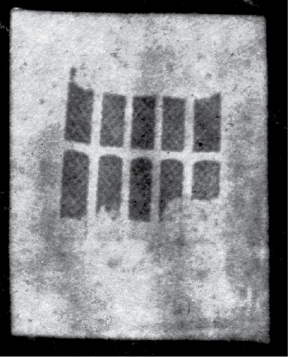
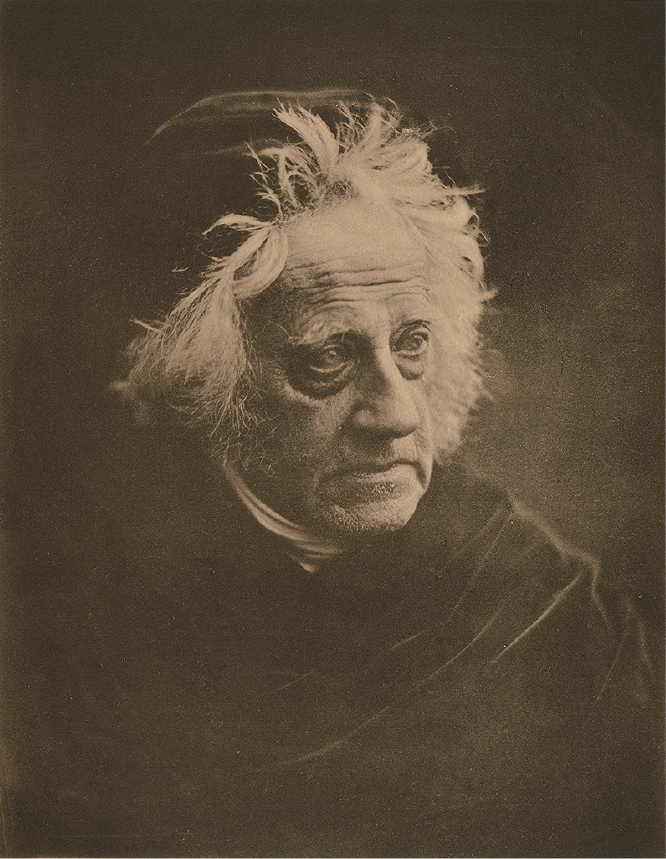
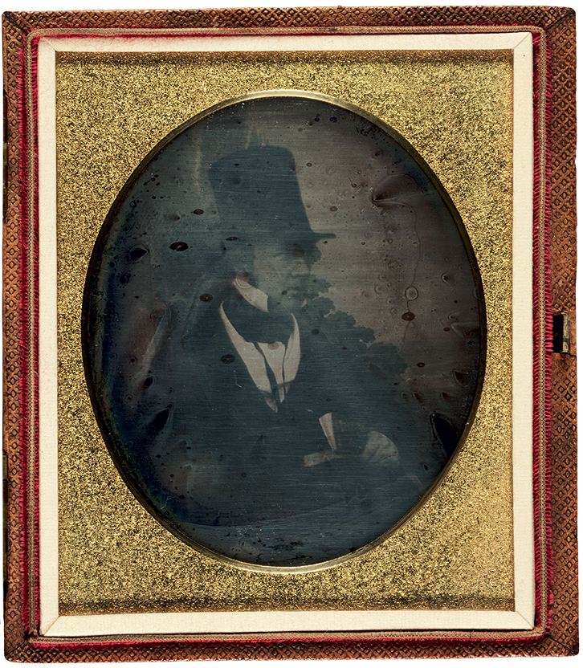

On May 9, 1839, the scientist and astronomer Sir John Frederick William
Herschel wrote from Paris to William Henry Fox Talbot, a close friend
and longtime scientific correspondent:

> Though much pressed for time I cannot resist writing to you first to
> say that I have this moment left Daguerre’s who was so obliging as to
> shew us all his Pictures on Silver saved from the fire which burned
> his house and also one on glass. — It is hardly saying too much to
> call them miraculous. Certainly they surpass anything I could have
> conceived as within the bounds of reasonable expectation. The most
> elaborate engraving falls far short of the richness & delicacy of
> execution\[;\] every gradation of light & shade is given with a
> softness & fidelity which sets all painting at an immeasurable
> distance.
>
> His *times* also are very short. — In a bright day 3 m suffices for
> the full effect up to the point where the lights become excessive. In
> dull or rainy days & in the interior of an apartment (for
> copying sculptures and pictures) from 5 to 10 m are requisite.[^1]

It is understandable that Herschel (1792–1871) was thrilled by his
springtime visit to Paris. Louis-Jacques-Mandé Daguerre’s discovery had
been announced to the public on January 6, 1839, in the newspaper
*Gazette de France,* and the story, with its description of his
“beautiful designs,” received attention from both the British and the
American press.[^2] However, following the announcement,
Daguerre (1787–1851) was involved in protracted negotiations with the
French government regarding purchase rights to his process, and for
almost eight months, between January and August, there was no
explanation forthcoming as to exactly how he had accomplished this feat,
or what chemical processes or materials might be involved. Outside
France, few people had actually seen a daguerreotype.

After reading about Daguerre’s accomplishment in the paper, but as yet
having no idea how he had done it or what kind of images had been
produced, Herschel spent much of January trying to figure it out for
himself. The big question was how one might fix an image on a
light-sensitive surface and render it permanent. Within just a few days,
the industrious Herschel had come up with an answer: “Tried hyposulphite
of soda to arrest action of light by washing away all the chloride of
silver or other silvering salt,” he wrote in his notebook on January 29,
1839. “Succeeds perfectly.”[^3]

As he would later learn on his trip to Paris, this process had little in
common with Daguerre’s. Whereas the Frenchman produced his one-of-a-kind
images on sheets of silver-plated copper, Herschel had been
experimenting on paper made sensitive to light with silver salts. The
paper-based process produced images that were pleasing in part because
of their rather misty, impressionistic effects; they lacked the
extraordinary clarity and detail of the daguerreotype. Indeed, as
Herschel reportedly remarked to François Arago, director of the Paris
Observatory and the issuer of his invitation to view Daguerre’s work,
the paper process “produces nothing but vague, foggy things. There is as
much difference between these two products as there is between the moon
and the sun.”[^4]

Herschel’s reaction to the markedly different look of the daguerreotype
and, in his view, its superior achievement was thus generous as well as
ecstatic. His letter to Talbot from Paris continues:

> The beautiful effect of River Scenes *in rain* must be seen to be
> appreciated. Sculptures are rendered in their most minute details with
> a beauty quite inconceivable.
>
> In scenes of great detail, every letter in distant inscriptions —
> every chip in the corner of every stone in every building is
> reproduced & distinctly recognizable with a strong lens\[. A\]ll the
> paving stones in *distant* chaussées are faithfully rendered.
>
> In short if you have a few days at your disposition I cannot command
> you better than to *Come & See*. Excuse this ebullition.[^5]

It’s highly likely, however, that Herschel’s “ebullition” was *not*
excused; in fact, every sentence of this letter must have set its
recipient’s teeth on edge.

Talbot (1800–1877), too, had been preoccupied with fixing camera images,
but for much longer — ever since the summer of 1833, while honeymooning
in Italy. In his attempts to sketch the scenery there, Talbot turned to
the popular drawing device called the camera lucida. Through the use of
lenses, it permitted the optical illusion that the scene surveyed or the
object studied was superimposed on the paper before the draftsman.
Talbot found it of little help in sketching the landscape, but it
reminded him of something he had tried in Italy with a camera obscura
some ten years prior, using “transparent tracing paper laid on a pane of
glass in the focus of the instrument.” The objects on which the
apparatus was trained could be seen on the paper and traced with a
pencil. It now occurred to Talbot that it might be possible “to cause
these natural images to imprint themselves durably, and remain fixed
upon the paper!”[^6]

Early the following year, at home in England, Talbot set himself to work
to find a means of sensitizing paper. This he had accomplished by the
end of February 1834, with the use of silver chloride. He washed the
paper in a salt solution and then brushed it with silver nitrate (which
combined with the salt to form silver chloride). By placing small
objects such as leaves or a piece of lace on the now light-sensitized
paper outdoors in sunlight, he was able to temporarily produce an image,
in negative — what we might now call a photogram and Talbot then called
a “copy.”

Talbot knew that if after the image was made the paper might be rendered
no longer sensitive to light, the image could be permanently fixed and,
just as significant, he might be able to reproduce multiple, positive
instances of it. His initial attempts at fixing by use of a strong salt
solution were not fully successful, however, and these first images,
though lasting long enough to be viewed and admired, ultimately tended
to fade away. Talbot called them “reversals.”

Possibly the earliest mention of Talbot’s temporary successes comes in a
thank-you note from his sister-in-law Laura Mundy on December 12, 1834:

> Thank you very much for sending me such beautiful shadows, the little
> drawing I think quite lovely, that & the verses particularly excite my
> admiration, I had no idea the art could be carried to such perfection
> — I had grieved over the gradual disappearance of those you gave me in
> the summer & am delighted to have these to supply their place in my
> book.[^7]

It seems likely that those “beautiful shadows” were photograms, but the
“little drawing” was probably the result of Talbot’s further
experimentation, now with wood boxes, in an effort to capture the image
that might be thrown by light through a glass lens onto sensitized
paper.

Throughout the spring, and the unusually sunny summer, of 1835, Talbot
continued to set up box cameras on the grounds of his country house,
Lacock Abbey. One negative from those months — the image size is less
than an inch square — is preserved today in Bradford, at the National
Media Museum, with a note written by Talbot: “Latticed Window (with the
Camera Obscura) August 1835. — When first made, the squares of glass
about 200 in number could be counted, with the \[*sic*\] help of a lens”
(fig. 1).[^8]

Figure 1. William Henry Fox Talbot (British, 1800–1877), Latticed Window at Lacock
Abbey (with the Camera Obscura), August 1835. Salted paper negative,
sheet: 6.9 × 14.9 cm (2 11/16 × 5 7/8 in.). Bradford, National Media
Museum, 1937-0361

More than two years passed, during which time Talbot did not hurry to
make public his process — presumably because he was still unable to
satisfactorily resolve the problem of fixing the image. The images from
the summer of 1835 ultimately began to fade away; Lacock Abbey’s two
hundred panes of glass, initially so miraculous in their detail, could
not be retained. Finally, however, in November 1838, Talbot returned to
the topic and began to draft a paper on his findings to present to the
Royal Society. And then, just after the New Year in 1839, came the
announcement of Daguerre’s accomplishment. Lacking details about what,
exactly, Daguerre had been able to produce, able to learn only that in
some way Daguerre, too, had managed to fix camera images made by light,
Talbot felt surprised, affronted, and even cheated out of his role as
photographic pioneer.

Talbot didn’t want to wait to find out how Daguerre was making *his*
images permanent; it was in Talbot’s interest to prove that he knew
nothing about Daguerre’s results and that his discoveries took
precedence over them. Talbot, as we know, had not solved the problem of
the gradual disappearance of the images that had been so beautifully
captured on paper. Nonetheless, galvanized by Daguerre’s announcement,
he rushed to present some examples of his own process to the Royal
Society on January 25, and on January 31 he read a hastily drafted paper
to the society explaining exactly how and when he had made his images of
“flowers and leaves; a pattern of lace; figures taken from painted
glass; a view of Venice copied from an engraving; some images formed by
the Solar Microscope … various pictures, representing the architecture
of my house in the country; all these made in the summer of 1835.”[^9] On January 25 he also wrote to Sir
John Herschel, who had been following the story with interest, to tell
his old friend that he himself had in fact “discovered about five years
ago … the possibility of fixing upon paper the image formed by a Camera
Obscura; or rather, I should say, causing it to *fix itself*.”[^10]

It’s a little surprising that Talbot, despite a correspondence of many
years with Herschel on matters scientific and horticultural, appears not
to have previously mentioned to him any of the experiments at Lacock
Abbey with cameras. Was his motive competitiveness? Was it a desire to
bring his “photogenic drawing” (as he called his process) to more
sophisticated and permanent ends before sharing it with the rest of the
world? Whatever the reasons for his earlier silence, now that news of
Daguerre’s invention was being covered by the leading scientific
publications of the day, Talbot decided it was time that Herschel should
call on him in London to view “specimens of this curious process.”[^11]

On January 27, however, Herschel wrote back from his country house in
Slough to say that he was unable to get to town, owing to “many
engagements to say nothing of a rheumatic affliction which confines me a
large portion of each day to my bed.”[^12] Talbot would have to pay a visit to
Herschel instead.

Since Herschel’s entry in his personal notebook regarding his success
with sodium hyposul-phite as a fixing agent is dated only two days after
that, on January 29, it’s hard not to imagine the astronomer (fig. 2) in
his dressing gown, feeling under the weather (or possibly not), but
nonetheless trying to come up with his own fixer before Talbot (fig. 3)
could show up in Slough with his “specimens.” In any event, the day
after his discovery, on January 30, Herschel wrote again to Talbot,
alerting him to his latest findings: “I have myself been thinking since
I got your note about this enigma… . If the whole of the unreduced
Chloride be *washed out* of *the paper* which may be done
*instantaneously* and *to the last atom* by a process I have discovered
— leaving the reduced silver still on the paper in the form of a fine
Brown or Sepia tint — our picture becomes permanent.” Herschel then
revised this letter, adding in a postscript to the second version that
“on trial the Hyposulphite appears to answer perfectly the end.”[^13] So it was that on Friday, February
1, 1839, Talbot, carrying his “Camera Obscura pictures”[^14] with him, took a day-return ticket
on the new train down to Slough.

Figure 2. Julia Margaret Cameron (British, born India, 1815–1879), Sir John F. W.
Herschel, 1867. Carbon print, 29.8 × 23.2 cm (11 3/4 × 9 1/8 in.). Los
Angeles, J. Paul Getty Museum, 84.XM.349.4

Figure 3. Antoine Claudet (French, 1797–1867), Portrait of William Henry Fox
Talbot, ca. 1844. Daguerreotype, 9.5 × 8.4 cm (3 3/4 × 3 5/16 in.).
Bradford, National Media Museum, 2003-5001/2/20882

Herschel’s work with “hypo,” Talbot discovered, did indeed answer
“perfectly the end” and was a vital contribution to the progress of this
as yet unnamed art. Moreover, in contrast to Daguerre, who was
preoccupied with secrecy, Herschel had no reservations about sharing his
discovery of the fixing process. He permitted Talbot to make the
findings public, with the result that following their publication by the
French Academy of Sciences, hypo was picked up by Daguerre himself.[^15] Today, Herschel is also credited
with coming up with the umbrella term used to describe the work of both
Daguerre and Talbot—*photography*—a word that would be formalized by
Talbot a couple of years later in a public letter to the *Literary
Gazette*. And in May 1839, just three months after Talbot’s visit to
Slough, Herschel was one of the few British scientists invited by Arago
to go to Paris to see what it was that Daguerre had produced.

It’s hard, then, to imagine that when Talbot received Herschel’s letter
from France he could have been as enthused as his friend was by the
evident superiority of the daguerreotype. But one thing, at least, was
finally clear to everybody: the two processes, English and French, were
very different.

[^1]: John Frederick William Herschel to William Henry Fox Talbot, May 9, 1839, in *The Correspondence of William Henry Fox Talbot,* ed. Larry J. Shaaf, De Montfort University, Leicester, <http://www.foxtalbot.dmu.ac.uk>. The manuscript collections, and the depositories of the collections, in which all of Talbot’s letters cited in this essay can be found, are identified on this Web site.

[^2]: H. Gaucheraud, “The Daguerotype \[*sic*\],” *Gazette de France*, January 6, 1839, reprinted in *Literary Gazette*, January 12, 1839, 26.

[^3]: Quoted in Beaumont Newhall, *The History of Photography*, rev. ed. (New York, 1982), 21.

[^4]: Newhall, *History of Photography* ([note 3](01_early_days.html#fn:3)), 23.

[^5]: Herschel to Talbot, May 9, 1839 ([note 1](01_early_days.html#fn:1)).

[^6]: William Henry Fox Talbot, *The Pencil of Nature* (Project Gutenberg e-book 33447 of Longman, Brown, Green and Longmans, London, 1844 edition), 4.

[^7]: Laura Mundy to Talbot, December 12, 1834, in *Talbot Correspondence* ([note 1](01_early_days.html#fn:1)).

[^8]: Newhall, *History of Photography* ([note 3](01_early_days.html#fn:3)), 20.

[^9]: *Literary Gazette*, February 2, 1839, 74.

[^10]: Talbot to Herschel, January 25, 1839, in *Talbot Correspondence* ([note 1](01_early_days.html#fn:1)).

[^11]: Talbot to Herschel, January 25, 1839, in *Talbot Correspondence* ([note 1](01_early_days.html#fn:1)).

[^12]: Herschel to Talbot, January 27, 1839, in *Talbot Correspondence* ([note 1](01_early_days.html#fn:1)).

[^13]: Herschel to Talbot, January 30, 1839, in *Talbot Correspondence* ([note 1](01_early_days.html#fn:1)).

[^14]: Talbot to Herschel, January 28, 1839, in *Talbot Correspondence* ([note 1](01_early_days.html#fn:1)).

[^15]: Newhall, *History of Photography* ([note 3](01_early_days.html#fn:3)), 21.
