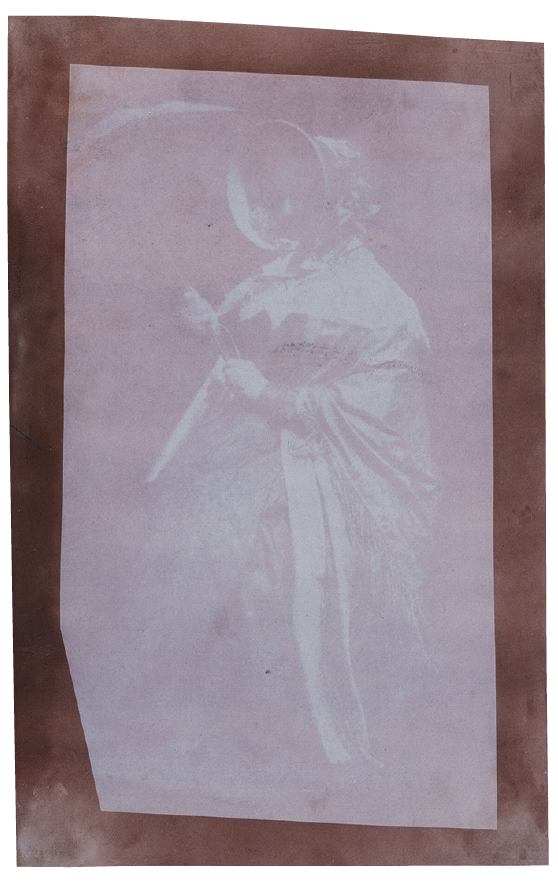
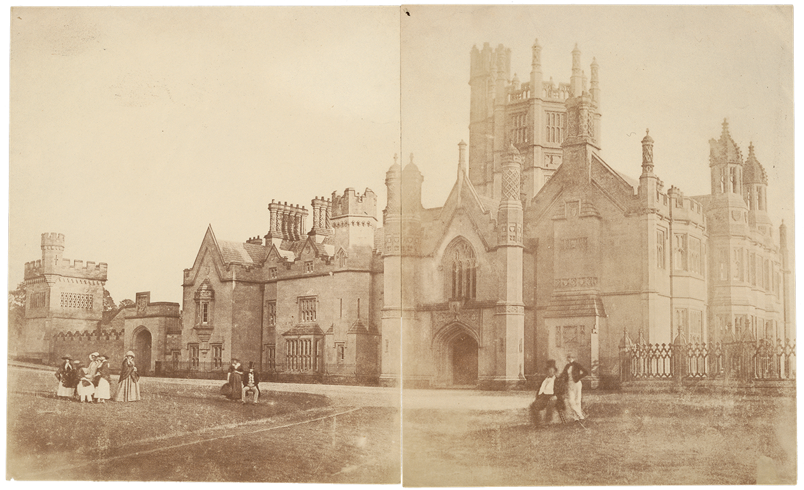
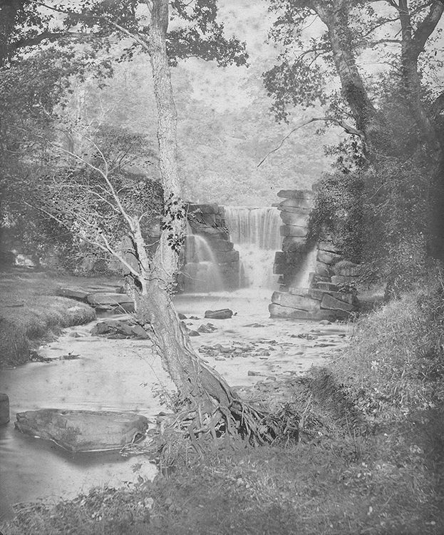

Lady Elisabeth Feilding (1773–1846; fig. 6), was a woman of strong
opinions, and one of them was that her son, Henry Talbot, should become
famous for his inventions. Writing to him in February 1839, Lady
Elisabeth congratulated Talbot and his wife, Constance, on the recent
birth of their new daughter but moved swiftly to the real purpose of her
letter: “I was quite surprized at your making the secret of the
Photogenic Drawing known, it precludes entirely all chance of your
making *your fortune* by selling it as M. Daguerre intended or getting a
patent.” Of the new arrival, she added in closing that “Horatia
\[Henry’s half sister\] proposes her name should be *Iodine* in honor of
your discovery.”[^23]

Figure 6. William Henry Fox Talbot (British, 1800–1877), Lady Elisabeth Feilding,
August 21, 1841. From the Brewster Album. Salted paper print from a
paper negative, 15.6 × 9.2 cm (6 1/8 × 3 5/8 in.). Los Angeles, J. Paul
Getty Museum, 84.XZ.574.51

Despite Lady Elisabeth’s irritation at her son’s inability, as she saw
it, to profit from his scientific pursuits by being slow to publish the
results (“If you would only have made it known *one* year ago, it could
never have been disputed, or doubted”),[^24] Talbot’s mother was photography’s
ardent champion and energetically promoted samples of it among the
family and members of her aristocratic circle. News of the
accomplishment spread rapidly; everyone she knew, it seemed, was
interested both in seeing the “drawings” and in learning how they might
be made. Talbot sent her packets of samples for her friends. “People
pillage me dreadfully,” she wrote in response. “I was obliged to give
some of my worst to Julia Sheffield because I really could not spare any
more of the best… . Horatia took your Photogenics to Matilda who was
exceedingly pleased with your having sent them. H. saw her put them with
the others into a small house of carton she has constructed on
purpose.”[^25] “Pray send me some
little thing to amuse a sick friend of mine,” wrote his cousin Mary
Talbot from Dorchester. “She was much pleased when I showed her the
little Campanula you sent me some time ago.”[^26] Christopher Rice Talbot, at home at
Margam Hall (fig. 7), in Glamorgan, was also
pleased with his “photogenic specimens”: “That representing an etching
has faded away since it came, but at first, it was beautiful. Every body
here is mad for photogeny.”[^27]
Another cousin, Charlotte Traherne, wrote to Talbot from Penllergare
(fig. 8), the Llewelyn family estate in Wales,
that she was “charmed with the piece of lace you sent” (presumably a
photogram): “It is much too pretty for you to have it again — John
Llewelyn has been making some paper according to your process and they
are all busy trying little scraps of lace & ribbon\[. O\]ne succeeded
very well this morning before breakfast but the day is clouding over —
Mr. Calvert Jones is quite wild about it.”[^28]

Figure 7. Reverend Calvert Richard Jones (British, 1804–1877), Untitled (Two-Part
Panorama Study of Margam Hall with Figures), ca. 1845. Salted paper
prints from paper negatives, 22.5 × 37.2 cm (8 7/8 × 14 5/8 in.). Los
Angeles, J. Paul Getty Museum, 89.XM.75

Figure 8. John Dillwyn Llewelyn (British, 1810–1882), In the Grounds, Penllergare,
ca. 1855. Albumen silver print, 29.5 × 24.8 cm (11 5/8 × 9 3/4 in.). Los
Angeles, J. Paul Getty Museum, 84.XP.769.51

Talbot’s discovery was all the rage among the country-house set, with
both women and men taking up the new hobby. Even Constance Talbot, whose
letters betray little interest in photography, worked anxiously to
master the printing process so as to answer her husband’s frequent
requests from town for more samples of his work. Meanwhile, her
mother-in-law, Lady Elisabeth, was determined to get the pictures into
the most aristocratic hands, and with family connections it was
surprisingly easy for her to accomplish this. Talbot’s cousin Theresa
Digby was a “Woman of the Bedchamber” at Buckingham Palace, officially
Queen Victoria’s London residence since her accession to the throne two
years earlier. On April 8, 1839, Theresa wrote to tell Talbot that his
half sister Caroline had sent her “an attempt at a Photogenic drawing”
and that she had duly shown it to the queen, “who was very much
interested with it.” Naturally, Theresa now wanted Henry to send along
something better: “I should like exceedingly for her to see something
more worth looking at, and if you could send me one of your own doing I
should be very much obliged.”[^29]
Talbot acceded, sending some images to town from Lacock Abbey, which his
mother then gave to their footman to deliver (“Wright took your
Photogenics to the Palace,”[^30]
she informed her son). A week later he got this encouraging response
from Theresa:

> Many thanks for the drawings which I showed to the Queen yesterday
> evening after dinner, they met with universal admiration from a large
> party; I am sorry to tell you that the Queen was more struck by the
> exactness of the similitude of the *ribbon*, than the beauty of the
> ferns & grasses, the gauze ribbon she said was *very curious*, and she
> must try to do some herself.[^31]

Lady Elisabeth was, of course, inclined to pursue the opening: “I
understand the Queen being no Botanist admires *most* the riband you
sent her. Therefore I have \[a\] mind to send you a bit of beautiful
Point Lace which I think would have great success — shall I? I wish you
would send me some more to lay on my table. Louisa has a vast number of
Morning visitors expressly to see them.”[^32]

By April 1839 the circle of interested persons had expanded to include
not only the queen but also European royalty. Lady Elisabeth could
hardly contain herself with the news that a “Dr Hamel” from Hamburg had
been in touch with her to get some images to send to Russia “for the
Emperor’s second son, a very scientific young Man. He wishes to lay some
before the Czarowitch.”[^33] And
Queen Victoria’s interest in Talbot’s work continued; indeed, Elizabeth
Heyert makes the appealing claim that during the queen’s proposal of
marriage to Prince Albert on October 15, 1839, “to allay her
nervousness, she talked to him first about Daguerre’s newly published
invention.”[^34] According to
Victoria’s diary, in March 1842 her husband posed for his own
daguerreotype while the couple was staying in Brighton (see fig.
39).[^35] In November 1843, Lady
Elisabeth wrote to Talbot that her daughter Caroline, his half sister,
now a lady-in-waiting at the palace, had “shewed those little Talbotypes
you sent her lately to the Queen Sunday Evg, who was so delighted with
them that C. thought herself obliged to offer them, & C. is to stick
them into the Album you gave the Q. Her majesty sent for her magnifying
glass to inspect them.”[^36]

Despite Lady Elisabeth’s triumph in her son’s successes with the palace,
she was still inclined to focus on the lost opportunity of, first,
securing a fortune through the invention and, second, claiming a place
in history for the family name. When she learned, via the *Allgemeine
Zeitung*, that a four-foot-long calotype had been made of “one of the
most important documents of Modern times, the Treaty of Peace with the
Emperor of China,” she was incensed. “One copy is ordered for the Queen,
to be framed & glazed & hung up at Buckingham Palace,” she quoted from
the paper in a letter to her son. “Why did not *you* do this for her
Majesty?”[^37]

[^23]: Elisabeth Feilding to Talbot, February 27, 1839, in *Talbot Correspondence* ([note 1](01_early_days.html#fn:1)). Horatia was not alone in her ideas for the new baby: Harriot Mundy, one of Talbot’s sisters-in-law, had just the day before suggested that “the young Lady *must* be called *Photogena* in memory or rather honour of your new discovery!” Harriot Mundy to Talbot, February 26, 1839, in *Talbot Correspondence* ([note 1](01_early_days.html#fn:1)).

[^24]: Elisabeth Feilding to Talbot, February 3, 1839, in *Talbot Correspondence* ([note 1](01_early_days.html#fn:1)).

[^25]: Elisabeth Feilding to Talbot, June 11, 1839, in *Talbot Correspondence* ([note 1](01_early_days.html#fn:1)).

[^26]: Mary Talbot to Talbot, March 18, 1839 (postmarked April 19, 1839), in *Talbot Correspondence* ([note 1](01_early_days.html#fn:1)).

[^27]: Christoper Rice Mansel Talbot to Talbot, March 30, 1839, in *Talbot Correspondence* ([note 1](01_early_days.html#fn:1)).

[^28]: Charlotte Traherne to Talbot, February 28, 1839, in *Talbot Correspondence* ([note 1](01_early_days.html#fn:1)). John Llewelyn was to become a serious amateur photographer, as was the Reverend Calvert Richard Jones.

[^29]: Theresa Digby to Talbot, April 8, 1839, in *Talbot Corre-spondence* ([note 1](01_early_days.html#fn:1)).

[^30]: Elisabeth Feilding to Talbot, April 13, 1839, in *Talbot Correspondence* ([note 1](01_early_days.html#fn:1)).

[^31]: Theresa Digby to Talbot, April 13, 1839, in *Talbot Correspondence* ([note 1](01_early_days.html#fn:1)).

[^32]: Elisabeth Feilding to Talbot, April 18, 1839, in *Talbot Correspondence* ([note 1](01_early_days.html#fn:1)).

[^33]: Elisabeth Feilding to Talbot, April 30, 1839, in *Talbot Correspondence* ([note 1](01_early_days.html#fn:1)).

[^34]: Elizabeth Heyert, *The Glass-House Years: Victorian Portrait Photography, 1839–1870* (Montclair, N.J., 1979), 78.

[^35]: Helmut Gernsheim, *Victoria R: A Biography* (New York, 1959), 257.

[^36]: Elisabeth Feilding to Talbot, November 14, 1843, in *Talbot Correspondence* ([note 1](01_early_days.html#fn:1)).

[^37]: Elisabeth Feilding to Talbot, January 16, 1843, in *Talbot Correspondence* ([note 1](01_early_days.html#fn:1)). A version of Henry Collen’s facsimile of the Treaty between Great Britain and China survives in the Royal Library today, RCIN 1047556.
