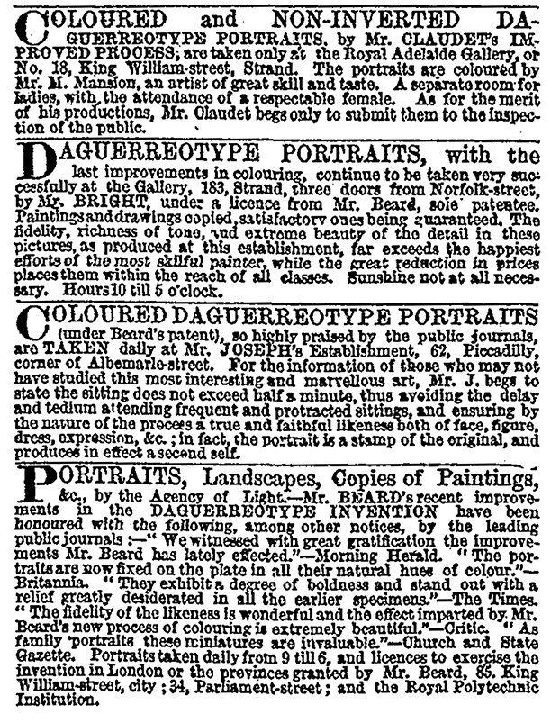

As the making of both daguerreotypes and calotypes became more widely
understood and practiced, and as the evolution of both processes led to
better results, advertisements in the *Times* and other papers began to
offer a variety of competing services (fig.
9), such as “coloured and non-inverted daguerreotype portraits”
or “a separate room for ladies, with the attendance of a respectable
female.” These notices, running daily in the classifieds of major
newspapers during the 1840s, were evidence of small refinements in
photography, such as hand tinting, that had come into vogue around the
same time that the issue of image reversal in daguerreotypes had been
resolved. Photography’s first professional “operators,” aiming at a
high-end market, stressed respectability, legality (patent cases
regarding the daguerreotype were frequently in the press), speed, and
likeness. “The sitting does not exceed half a minute,” assured one
advertisement, adding that “the portrait is a stamp of the original, and
produces in effect a second self.”[^56]

Figure 9. Classified advertisements for photographic services on the front
page of the Times (London), May 28, 1846.

Prices continued to be high. Claudet, who advertised his services in the
*Times* in both kinds of photography, charged from one to four guineas
for his daguerreotypes, and one guinea for a calotype portrait the size
of half a sheet of letter paper (43/4 ×
61/2 in., or 12.1 × 16.5 cm) — and
seven shillings sixpence for every extra copy. Beard charged two guineas
for one daguerreotype sitting (approximately what Constance Talbot in
1838 was expecting to pay for her daughters’ painted portraits).
Lesser-known photographers were more affordable, though for the most
part they could stay in business only if they were able to avoid paying
the licensing fees. The price of a quarter-plate daguerreotype
(31/4 × 41/4 in., or 8.3 ×
10.8 cm) was estimated by the *Edinburgh Review* in 1843 at “five
or six shillings.”[^57] Cases and
frames, however, were ornate and expensive, and even the smallest
pictures remained out of reach for many working people.[^58] The limitations put on British
photographers as a result of patents on both the daguerreotype and
calotype significantly limited photography’s use and kept prices high.

In America, by contrast, there was no patent to contend with. A
daguerreotype made in New York was initially not cheap — according to
the photographer and historian Bill Jay, the cost of a sixth plate
(33/4 × 31/4 in., or 9.5 ×
8.3 cm) was about five dollars, which in the 1840s might be a
week’s wage for the average American worker. ^59^ However, within just a
few years, demand became so high that thousands of picture-making
establishments opened across the United States. Prices were pushed down
and production soared. Thus while in 1852 there were, according to
Elizabeth Eastlake in the *Quarterly Review*, only seven officially
listed photographers in the London directory,[^60] in New York the previous year,
according to the *Scientific American*, there were “127 operators, and
thousands upon thousands of pictures … taken every year.”[^61] Americans were clearly as
enthusiastic about photography as their European counterparts. At the
Great Exhibition of 1851, three of the five medals awarded for
daguerreotypes were won by Americans.[^62]

Despite its enormous popularity, the daguerreotype was to be relatively
short-lived. Daguerreotypes were delicate and easily broken, and more
significantly, they could not easily be reproduced. Although Talbot’s
calotype process never achieved the remarkable precision of detail
permitted by the daguerreotype, the possibility of reproducing the
images secured its longevity. Throughout the 1840s many photographers
also enjoyed the aesthetically pleasing depth and gentleness of tone
that seemed to ally the paper process more overtly with artistic
practices.

Meanwhile, and presumably following Daguerre’s lead, Talbot set about
trying to prosecute any unauthorized calotype practice. At 100 to 150
pounds per year, Talbot’s licensing fee was no small sum, but as the
practice of photography expanded, prosecution became impossible for
Talbot to pursue, and profits were slim. Lady Elisabeth policed the
classifieds, bemoaning the various ways in which photographic operators
were attempting to bypass or circumvent the patenting restrictions,
bringing photography in effect within reach of the middle class. “My
Dear Henry,” she wrote on September 15, 1844,

> Have you seen an advertisement which professes to sell at No 98
> Cheapside not only photographic cameras, but iodine boxes, bromine
> pans, iodized paper & every chemical preparation & apparatus required
> in Photography, with full instruction given to purchasers, & shortly
> will be published *Plain* directions for obtaining Pictures *on Paper*
> by the Calotype Process. How can they do all this without a licence
> from you? Claudet I see advertises the Talbotype Portraits almost
> every day in the *Times*.[^63]

The problem of patent infringement was soon resolved for all sides. In
1851 the wet collodion process invented by Frederick Scott Archer
(1813–1857) came onto the market unhampered by any licensing fees.
Archer’s process, in which negatives were developed on glass, produced
sharper images and clearer details than the calotype, and it was cheaper
and easier to use than the daguerreotype. Multiple images could be made
from wet collodion negatives. Talbot’s initial efforts later that year
to sue a photographer for using the wet collodion process without a
calotype license, based on his conviction that he owned the rights to
the negative-positive process, were unsuccessful, and he must have
realized by this point that any financial stake he might once have had
in photography’s unforeseeable future was evaporating. In 1852, after
members of the Royal Society appealed to him on behalf of the many
photographers who felt themselves unduly burdened by his licensing fee,
Talbot agreed to abandon his claims.

From 1851 until 1880 wet collodion dominated photographic practices
everywhere. In Britain, with the expiration of patents, photographic
studios opened in almost every town, and prices went down significantly.
By 1857 photography was, as Elizabeth Eastlake put it,

> a household word and a household want; … used alike by art and
> science, by love, business, and justice; … found in the most sumptuous
> saloon, and in the dingiest attic — in the solitude of the Highland
> cottage, and in the glare of the London gin-palace—in the pocket of
> the detective, in the cell of the convict, in the folio of the painter
> and architect, among the papers and patterns of the millowner and
> manufacturer, and on the cold brave breast on the battle-field.”[^64]

From Buckingham Palace to the London gin palace, photography, it seemed,
at last belonged to everyone.

### Notes

[^56]: *Times* (London), May 28, 1846, 1.

[^57]: *Edinburgh Review*, January 1843 ([note 39](04_photographic_portraiture.html#fn:39)), 67.

[^58]: During the 1860s, according to Bill Jay, the average weekly income for an agricultural worker was between eleven and fifteen shillings. Even to a person with some skills working, say, in a photography studio, a daguerreotype might represent more than a week’s wages. Bill Jay, “Prices of Photographs: Average Charges for Images in Victorian Photographic Studios 1841–1891,” <http://www.billjayonphotography.com>.

[^59]: Jay, “Prices of Photographs” ([note 55](04_photographic_portraiture.html#fn:55)).

[^60]: Eastlake, “Photography” (note 21), 443.

[^61]: “Daguerreotype — New Discovery,” *Scientific American* 6, no. 19 (January 25, 1851), 145.

[^62]: Newhall, *History of Photography* ([note 3](01_early_days.html#fn:3)), 34.

[^63]: Elisabeth Feilding to Talbot, September 15, 1844, in *Talbot Correspondence* ([note 1](01_early_days.html#fn:1)).

[^64]: Eastlake, “Photography” (note 21), 442.
