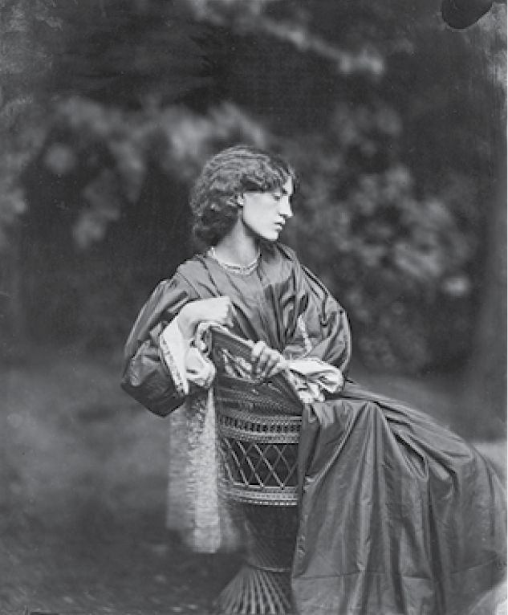
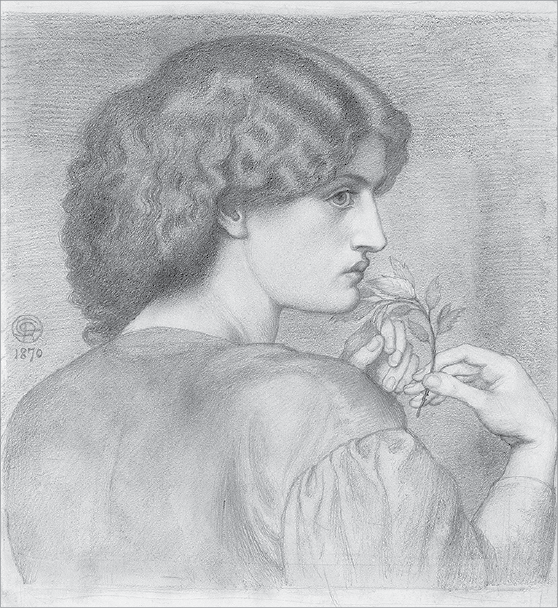
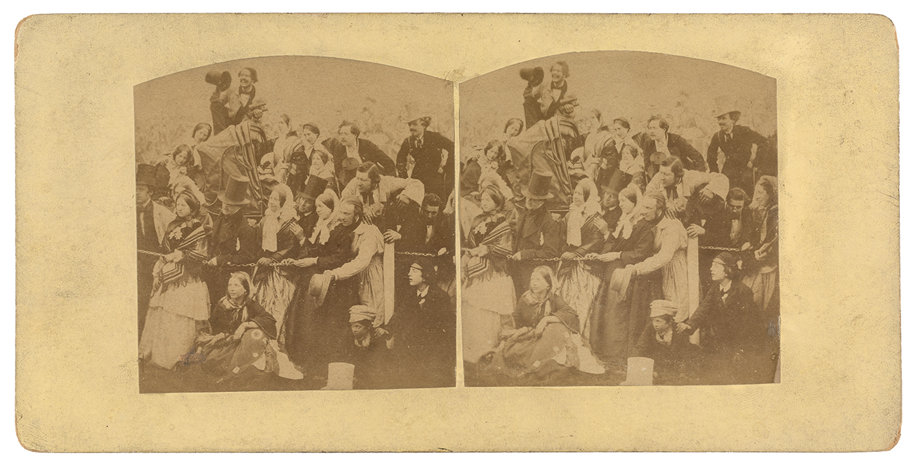
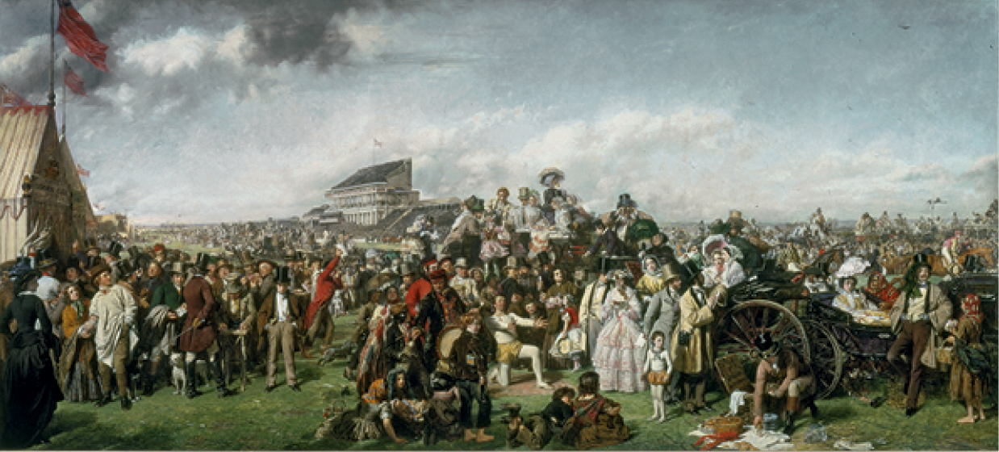

If there is one thing that unites early and late discussion of
photography, it is the issue of truthfulness. Most of the first comments
on photography were excited responses to its extraordinary accuracy and,
at least initially, its perceived inability to lie. The likeness that
Constance Talbot sought in the paintings of her children was guaranteed
by the camera; it is small wonder that visual artists were quick to make
use of photography in drafting their own work (or that they were less
quick to acknowledge photography’s assistance). The work of the
Pre-Raphaelites is a case in point. We know that Dante Gabriel Rossetti
(1828–1882) posed Jane Morris for photographs (fig.
10) and used the results in his portrait work
(fig. 11); the results are striking. Michael
Bartram tells us that “John Everett Millais from the mid-1850s onward,
relied more and more on photography for landscape backgrounds and
portraits,” whereas the lesser known Atkinson Grimshaw “secretly painted
over photographs.”[^65] The artist
William Powell Frith (1819–1909) was publicly no fan of the
Pre-Raphaelites, but like them he benefited from photographs that helped
him draft his paintings. *The Derby Day* (fig.
12), arguably his best-known work, made use of photographs by
Robert Howlett (1831–1858) that Frith had commissioned of the grandstand
and groups of people (fig. 13). The
*Photographic News* reported a couple of years later that “Mr. Samuel
Fry has recently been engaged in taking a series of negatives, 25 inches
by 18 inches, and 10 inches by 8 inches, of the interior of the Great
Western Station, engines, carriages, etc. for Mr. Frith, as aids to the
production of his great painting ‘Life at a Railway Station.’ Such is
the value of the photograph in aiding the artist’s work, that he wonders
now however they did without them!”[^66]

Figure 10. John Robert Parsons (British, ca. 1826–1909, act. 1860s–1870s), Untitled
(Portrait of Jane Morris \[Mrs. William Morris\]), negative, July 1865;
print, ca. 1900. Gelatin silver print, 23.7 × 19.5 cm (9 5/16 × 7 11/16
in.). Los Angeles, J. Paul Getty Museum, 84.XM.847.2

Figure 11. Dante Gabriel Rossetti (British, 1828–1882), The Roseleaf, 1870.
Graphite on wove paper, 39.1 × 35.2 cm (15 3/8 × 13 7/8 in.). Ottawa,
National Gallery of Canada, 3202

Figure 12. William Powell Frith (British, 1819–1909), The Derby Day, 1856–58. Oil
on canvas, 101.6 × 223.5 cm (40 × 88 in.). Bequeathed by Jacob Bell,
1859. London, Tate Collection, N00615

Figure 13. Robert Howlett (British, 1831–1858), Untitled (Study for the Large
Painting “Derby Day,” by William Powell Frith), 1856. Albumen silver
stereograph, 8.6 × 17.5 cm (3 3/8 × 6 7/8 in.). Gift of Weston J. and
Mary M. Naef. Los Angeles, J. Paul Getty Museum, 84.XC.979.4532

It is noteworthy not so much that painters used photography, or even
that on occasion they kept the practice quiet, but that the look of
photography was the desired effect. In large part because of the
obsessive preoccupation with detail, many Victorian paintings seem to
promise that through looking the world can be known. The implied viewer
of these works has a powerful, godlike eye. Indeed, the relationship
realist paintings celebrate between knowledge and vision is in many ways
the defining characteristic of the earliest daguerreotypes and speaks to
their epistemological as well as aesthetic appeal. Herschel’s delight in
1839 at the revelations of a magnifying glass held up to a daguerreotype
was a delight in scale but also in a world revealed — a world, in other
words, that might be *known*.

The truthfulness of photography, of course, was not always welcome. In a
humorous piece of doggerel, Lewis Carroll recorded the difficulties of
trying to take a portrait of a family in which beauty was apparently
lacking. After numerous failures at making individual portraits, the
photographer, “Hiawatha,”

> Tumbled all the tribe together,\
> (“Grouped” is not the right expression),\
> And, as happy chance would have it,\
> Did at last obtain a picture\
> Where the faces all succeeded:\
> Each came out a perfect likeness.

Naturally, nobody is pleased with this result. Carroll continues:

> Then they joined and all abused it,\
> Unrestrainedly abused it,\
> As the worst and ugliest picture\
> They could possibly have dreamed of.[^67]

As one might expect, the photographer makes a number of appearances in
popular fiction of the age, represented in some cases as an outsider, as
a worker of magic or science who is socially marginalized (though at
times, through his association with the arts, within the boundaries of
acceptability). Sir Arthur Conan Doyle was deeply interested in
photography’s capacity for truth as well as illusion, and Sherlock
Holmes is wise to its potential. Thomas Hardy used photographs in a
number of his novels to indicate the social aspirations of characters
who employ them in tasteful household arrangement, or exchange them with
sweethearts and sell them off when love departs.[^68]

Considerably more subtle, however, but far-reaching in impact, were the
stylistic changes in literature that were brought about by the broader
visual culture in which photography participated. What we might call the
pictorial emphasis of the Victorian novel — its predilection for
description; its attention to theater and scene; its sensitivity to
point of view and perspective — is arguably a symptom of the
omnipresence of image making in Victorian society to which photography
contributed. Dickens’s fondness for using the present tense in moments
of heightened visual attention and pathos anticipates the shift to the
present tense that we today undertake without thinking as we show others
our own lives in photographs.[^69]

Photography’s implicitly democratic message also emerges in a variety of
ways throughout the literature of the period. Toward the end of George
Eliot’s *Middlemarch* (1871), for example, the heroine, Dorothea, gets
up after a night spent on the floor. Previously consumed with her own
romantic distress, in the early morning light she feels a need to put
aside self-interest and reach out and connect with the wider world:

> She opened her curtains, and looked out towards the bit of road that
> lay in view, with fields beyond outside the entrance-gates. On the
> road there was a man with a bundle on his back and a woman carrying
> her baby; in the field she could see figures moving — perhaps the
> shepherd with his dog. Far off in the bending sky was the pearly
> light; and she felt the largeness of the world and the manifold
> wakings of men to labour and endurance. She was a part of that
> involuntary, palpitating life, and could neither look out on it from
> her luxurious shelter as a mere spectator, nor hide her eyes in
> selfish complaining.[^70]

This is a vitally important moment, not just for Dorothea and the rest
of *Middlemarch* but for the history of the novel itself. It marks as
deeply significant the simple and invisible act of *thinking*, but it
also suggests that the view from the country house — from Lacock Abbey
and places like it — might be widening to encompass a broader world.
Dorothea does not reach for a camera to record the figures who are
outside the entrance gates, but the eye of fiction notes them and forces
an acknowledgment by its readers as well as its heroine that the human
lot is inevitably bound up with those who walk and work and live beyond
the boundary of one’s own life. Meanwhile, photography, too, began to
demonstrate an increased imaginative sympathy for the lives of the
working poor and to force a growing sense of the commonality of human
existence. Henry Mayhew’s three-volume work of social record, *London
Labour and the London Poor* (1851), was copiously illustrated with
engravings made from photographs of street merchants, hustlers, and
representatives of London’s underclass. As much as the work invited the
gaze of the armchair tourist who might never set foot in the East End,
Mayhew’s portraits insisted upon the reader’s shared humanity with those
at the fringes of society. The sense of a wider world that Dorothea
begins to feel in *Middlemarch* speaks, like Mayhew’s work, to the
implicit *similarities* as much as to the differences among people.

Those similarities suggest one reason — perhaps the main reason — why
the Victorians seem more real to us than persons of earlier ages. It’s
not merely the proximity of our era and theirs; it is also that the
Victorians are the first human beings whom we can see through a medium
we consider to be both modern and, curiously, our own: the
photographic.[^71] Unable to
discriminate, photography emphasizes that all are a part of
“involuntary, palpitating life”; in fact, a portrait photograph really
signifies only that one *has* been part of that life. To many
Victorians, it was a pity that photography had come too late to capture
earlier figures from history. “Could we now see in photogenic light and
shadow Demosthenes launching his thunder against Macedon,” imagined one
dreamer in 1843, “or Brutus at Pompey’s statue bending over the bleeding
Caesar — or Paul preaching at Athens — or Him whom we must not name, in
godlike attitude and celestial beauty, proclaiming good-will to man,
with what rapture would we gaze upon impersonations so exciting and
divine!”[^72]

If it was too late to get a photo of Jesus of Nazareth, other celebrity
photographs were very popular. In New York in 1851, Mr. Gavitt’s studio
at the corner of Broadway and Murray Street offered a wonderful display:

> There is not a single great man in our country without his likeness
> there, and there are 170 pictures of distinguished Americans now no
> more, but who were living within the past six years. There was a
> likeness of the heroic Jackson, taken by an artist three days before
> the veteran died; Audibon \[*sic*\], Sir John Herschel, and many other
> men of note. All our great military and naval characters are to be
> seen there.[^73]

In Britain there was a similar trade in photographs of the royal family
and members of the aristocracy. Their portraits could be purchased at
studios and became for a while collectible items for both the middle and
upper classes. Constance Talbot wrote to her husband in April 1862:

> Could you get us a good Portrait of the Prince varying from the one
> sent to Ela, for the purpose of adding to your collection of
> Celebrities — Also a Portrait of the Queen, and as many others of the
> Royal family as you can meet with that are really good — We would put
> them into your Carte de visite Album wh. has many blank pages at
> present.[^74]

These “card-portraits,” as Oliver Wendell Holmes (1809–1894) called them
— small portrait photographs made not just for commercial purposes but
also for private exchange — had by 1863 become “the social currency, the
sentimental ‘Green-backs’ of civilization” — and no wonder; as Holmes
noted, the small portrait photo “is the cheapest, the most portable,
requires no machine to look at it with, can be seen by several persons
at the same time, — in short, has all the popular elements. Many care
little for the wonders of the world brought before their eyes by the
stereoscope; all love to see the faces of their friends.”[^75]

The practice of putting images into bound volumes and scrapbooks was
well established before the advent of photography, and the carte de
visite moved easily into the culture of albums, collage, and other
mixed-media techniques already popular in Victorian homes. With
astonishing rapidity, photography thus became part of the everyday world
of all Victorians, a staple of home furnishing and domestic amusement,
in evidence on every high street, in shop windows, and in the wider
culture of commerce. To some extent, therefore, as it became ordinary,
photography became less, rather than more, noticeable. “These miracles
are being worked all around us so easily and so cheaply,” wrote Holmes,
“that most people have ceased to think of them as marvels.”[^76] Holmes was disappointed by this,
since he regarded photography as the greatest invention of the age and
one whose limits could not possibly be imagined. Like their British
counterparts, however, Holmes’s fellow Americans were already taxed with
grasping the numerous technological breakthroughs of the day (Holmes’s
examples of challenges to the modern imagination are the railway, the
telegraph, and chloroform). Photography was just one among many
astonishing innovations. But Holmes felt that it was photography’s
*potential* that made it the era’s most powerful one; its future was
“not so easily, completely, universally recognized in all the immensity
of its applications and suggestions.”[^77]

Although Holmes was right about photography’s unimaginable potential —
its descendants, the information technologies and social media of the
twenty-first century, are arguably restructuring the nature of human
relations — in some ways what is most radical and profound about
photography was immediately obvious to the Victorians. As Holmes puts
it: “Those whom we love no longer leave us in dying, as they did of
old.” While our eyes “lose the images pictured on them,” and even
parents “forget the faces of their own children in a separation of a
year or two,” the “artificial retina … retains their impress.” In the
era of a newly conceived sense of historical and human oblivion,
photography was miraculous: “How these shadows last, and how their
originals fade away!”[^78] It is
hardly surprising that it was precisely this promise of reprieve from
mortality that drove much of the marketing of portrait photographs. The
prudent Victorian was advised to “secure the shadow ’ere the substance
fade” by letting “nature imitate what Nature made.”[^79]

### Notes

[^65]: Michael Bartram, *The Pre-Raphaelite Camera: Aspects of Victorian Photography* (Boston, 1985), 7.

[^66]: *Photographic News,* April 26, 1861, “Images of the Industrial Revolution in Britain.” <http://www.netnicholls.com/neh2001/pages/aspects7/75frame.htm>.

[^67]: Lewis Carroll, “Hiawatha’s Photographing,” reprinted in Goldberg, *Photography in Print* ([note 9](01_early_days.html#fn:9)), 119–22.

[^68]: See, for example, *Desperate Remedies* (1871), *A Laodicean* (1881), *Jude the Obscure* (1896), and the short story “An Imaginative Woman” (1894).

[^69]: For an extensive discussion of the novel’s stylistic response to a newly photographic culture, see Jennifer Green-Lewis, “Victorian Photography and the Novel,” in *The Oxford Handbook of Victorian Literature*, ed. Lisa Rodensky (Oxford, 2013), 313–34.

[^70]: George Eliot, *Middlemarch* (New York, 1985), 846.

[^71]: For more discussion of this idea, see Jennifer Green-Lewis, “At Home in the Nineteenth Century: Photography, Nostalgia, and the Will to Authenticity,” in *Victorian Afterlife: Contemporary Culture Rewrites the Nineteenth Century,* ed. John Kucich and Dianne Sadoff (Minneapolis, 2000), 29–48.

[^72]: *Edinburgh Review*, January 1843 ([note 39](04_photographic_portraiture.html#fn:39)), 65.

[^73]: “Daguerreotype — New Discovery” ([note 58](05_widening_circle.html#fn:58)), 145.

[^74]: Constance Talbot to Talbot, April 25, 1862, in *Talbot Correspondence* ([note 1](01_early_days.html#fn:1)).

[^75]: Oliver Wendell Holmes, “Doings of the Sunbeam,” in *Soundings from the Atlantic* (Boston, 1864), 255.

[^76]: Oliver Wendell Holmes, “Sun-Painting and Sun-Sculpture,” in *Soundings from the Atlantic* (note 72), 168.

[^77]: Oliver Wendell Holmes, “The Stereoscope and the Stereograph,” in *Soundings from the Atlantic* (note 72), 130.

[^78]: Holmes, “Sun-Painting and Sun-Sculpture” ([note 73](06_photography_other_arts.html#fn:73)), 170.

[^79]: Newhall, *History of Photography* ([note 3](01_early_days.html#fn:3)), 32.
