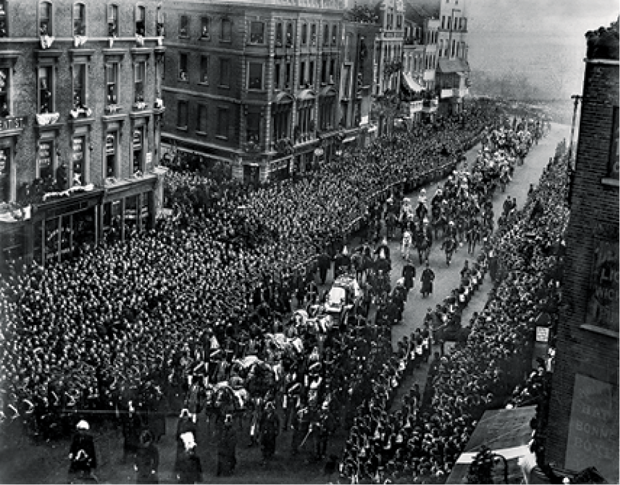

The last two decades of the Victorian age saw further refinements in the
photographic process. In 1871 the dry plate process was invented, making
photography faster and much less cumbersome. Dry plates, sturdier than
wet collodion, could be prepared in advance and were easier to
transport. In 1888 George Eastman introduced flexible dry film and the
small, hand-held Kodak camera. Not only might photography now be
practiced by more people; pictures could also be taken more discreetly.
When two brothers in Germany patented a camera designed to be hidden in
a hat, *Punch* magazine responded with some verse:

> If they knew what I wear when I walk in the street,\
> It should be quite a terror to people I meet;\
> They would fly when they saw me, and ne’er stop to chat,\
> For I carry a camera up in my hat.
>
> A Herr Luders, of Görlitz, has patented this,\
> And I think the idea is by no means amiss;\
> With a hole in my hat for the lens to peep through,\
> And a dry plate behind, I take portrait or view.[^80]

Although outside spy novels the photographic hat has yet to catch on,
the newly simplified processes of photography ensured that by the 1880s
it was in everyday use in police work and detective surveillance.
Meanwhile, down in the Dorset countryside, Hardy was learning the
meaning of fame in a photographic age and was disgruntled to find
himself the subject of tourist cameras aimed by cyclists over the hedges
of his garden at Max Gate. In London, Henry James reflected in his
notebooks on the eroding boundary between public and private spheres, a
consequence, he felt, of the “devouring publicity” of modern life.[^81]

As if to validate those concerns, in 1897 an anonymous “Member of the
Royal Household” published a tell-all narrative about Queen Victoria’s
private life, a work presumably designed to profit from the queen’s
Diamond Jubilee that year.[^82]
With a full-length photographic portrait of the queen as its
frontispiece, and a preface explaining its method of visualizing
Victoria as borrowed from “that of the old masters of the Dutch school,”
the book promised to help the reader picture the details of Victoria’s
daily life in all its splendor. Insisting that its realism is assured by
the copiousness of its details, the book recalls the appeal of early
daguerreotypes: the more that is seen and known, the text implies, the
closer the viewer may come to the *real* queen.

But by 1897 the notion of a shared and verifiable reality was noticeably
in question, as was the idea that empiricism and the accumulation of
visual detail could yield satisfactory answers to questions about the
nature of human existence. As fiction by James, Hardy, Wilde, and others
was showing, personal identity was no longer necessarily understood in
static terms, the sum total of a fixed number of facts. It was
susceptible to change, circumstance, perceptual nuance. It altered
across time. As the art critic Roger Fry put it in his discussion of
Impressionism (1894), “what … we call the same human figure, is not the
same inside the studio that it was outside, is not the same at 5 p.m.
that it was at 2 p.m. It is in each case only a momentary group of
sensations in the perpetual flux, existing in necessary relations to its
surroundings and an inseparable part of them.”[^83] While the single photograph might
suggest permanence, over the course of time photography tells a
different story. A family album kept throughout many years speaks of
mutability; it maps the story of genetic inheritance, making visible
time’s passage. Holmes’s words in 1861 are eerily prescient:

> Children grow into beauty and out of it. The first line in the
> forehead, the first streak in the hair are chronicled without malice,
> but without extenuation. The footprints of thought, of passion, of
> purpose are all treasured in these fossilized shadows. Family-traits
> show themselves in early infancy, die out, and reappear. Flitting
> moods which have escaped one pencil of sunbeams are caught by another.
> Each new picture gives us a new aspect of our friend; we find he had
> not one face, but many.[^84]

Each new picture made by a camera arguably helped usher in the
time-obsessed age of Modernism, an age that was to be haunted by the
multiplicity of the self, a self represented by Cubist painters as
having “not one face, but many.” Modernist literature of the early
twentieth century is preoccupied with the ambiguity of the word and the
unreliability of narration; it addresses itself to a generation that
will witness the shattering of the idea of objective truth into
innumerable past, potential, and simultaneous points of view. In all
this, photography will play a part.

The notion that human identity is neither stable, nor unified, nor
ultimately knowable is absent, however, from the tell-all book about the
queen. The aim of the work, after all, was to “fix” Victoria’s image.
One of its revelations is how self-conscious the queen was about that
image — how much she was aware of “performing” her royal, married,
domestic self. “It is quite a weakness of hers,” we hear, “to be
photographed in every possible condition of her daily life. Sitting in
her donkey chair, dangling \[*sic*\] the latest new baby, chatting in
her private sitting-room among her daughters, working at her
writing-table, or breakfasting in the open air … the Queen’s
photographer is always to be sent for and ordered to ‘fix the picture.’
”[^85]

Although Victoria was aware of the value of photography to the public
image of a modern monarch, she remained to the end of her life an avid
private consumer of photographs, every bit as interested in perusing
albums as she had been as a young woman first introduced to photogenic
drawings. According to our anonymous source, one of her more notable
“fads and fancies” was that she required everything in her possession to
be photographed. “Every piece of plate and china, every picture, chair,
table, ornament, and articles of even the most trivial description, all
pass through the photographer’s hands, and are ‘taken’ from every point
of view.” The resulting photographs were then arranged in “wonderful
bound catalogues,” vast volumes that were “many in number, large in
bulk, and … most expensive.” We hear that “Her Majesty is very fond of
her catalogues, and few days pass without her sending for one volume or
another.”[^86] It’s not entirely
clear from this account whether the queen liked her albums because of
the objects or the people represented in them. What we *are* told is
that she has “a sweet reverence for past happy times” and reveals “a
clinging that is touching in its intensity to everything that reflects
ever so slightly on the ‘days that are no more.’ ”[^87] As the cultural historian Stephen
Kern puts it, “Every age … has a distinctive sense of the past. This
generation looked to it for stability in the face of rapid
technological, cultural, and social change.”[^88] What could be more consoling to the
widowed monarch in her last years than these bound volumes of
photographs in which nothing more could ever change? What surer place to
find stability than in images of the past?

Photography’s nostalgic appeal must have been particularly powerful at
the close of the nineteenth century — the first century, as Talbot might
have put it, to have “drawn its own picture.” Through the auspices of
photography, Victoria was the first British monarch able to revisit
almost all the years of her long reign. In her albums she could view
images of her children and their weddings, and of her husband — in life
and, later, as a marble effigy. Victoria herself now exists for us in
photographs as a young woman, as an elderly matriarch — even on her
deathbed. Tucked inside her coffin, unseen by anyone and unbeknown to
most, were several photographs that she had previously selected to take
with her (fig. 14).[^89] Her
funeral procession on February 2, 1901, was not just photographed but
filmed; one can find it today on YouTube.

Daguerre was long dead by then, as were Talbot and Herschel, but many
other photographers were stationed along the route of the funeral
procession as it wound slowly through London (fig. 15). With the help of
a ladder, one of them even managed to scramble up on top of the Marble
Arch, where he perched perilously, braving the bitter cold, the long
hours of waiting, and the seemingly endless repetition of Chopin’s
Funeral March, to get the best picture that he could.[^90]

Figure 14. Unknown photographer, Photograph of Victoria on Her Deathbed, January
1901. Gelatin silver print, 15.1 × 19.8 cm (515 /16 × 713 /16 in.).
Windsor, The Royal Collection, RCIN 2943926

Figure 15. Unknown photographer, *Funeral Procession of Queen Victoria*, February
1901. Gelatin silver print, 28 × 35.5 cm (11 × 14 in.). London, National
Army Museum, NAM 1971-01-35-219

### Notes

[^80]: ‘The Photographic Hat,” reprinted in Leonard de Vries, *Victorian Inventions* (London, 1973), 112.

[^81]: Henry James, *Notebook*, 82, quoted in Richard Salmon, *Henry James and the Culture of Publicity* (Cambridge, 1997), 8.

[^82]: *The Private Life of the Queen, by a Member of the Royal Household* (New York, 1898), iii.

[^83]: Roger Fry, ‘The Philosophy of Impressionism,” in *A Roger Fry Reader,* ed. Christopher Reed (Chicago, 1996), 16.

[^84]: Holmes, “Sun-Painting and Sun-Sculpture” ([note 73](06_photography_other_arts.html#fn:73)), 169–70.

[^85]: *Private Life* ([note 82](07_photography_end_age.html#fn:82)), 119.

[^86]: *Private Life* ([note 82](07_photography_end_age.html#fn:82)), 119–20.

[^87]: *Private Life* ([note 82](07_photography_end_age.html#fn:82)), 112.

[^88]: Stephen Kern, *The Culture of Time and Space, 1880–1918* (Cambridge, Mass., 2003), 36.

[^89]: Christopher Hibbert, *Queen Victoria: A Personal History* (London, 2000), 498.

[^90]: In the moment at which the queen’s coffin passed beneath the arch, the photographer Paul Martin, who was standing at the monument’s base, had what is to modern readers a familiar experience: “Off came our hats and click went the shutters of the cameras. I have a faint recollection of seeing a Union Jack which covered the coffin, also the Kaiser on a white horse. My camera saw it all, but I had to wait until it could transfer to me the beauty and the solemnity of the occasion.” In other words, Martin missed the procession because he was too busy taking a picture of it. “You naturally like to take as many \[pictures\] as you can, so that your entire attention is centred on your job and you miss the pageant. Seeing the impressive scene on your dull view-finder of the size of a stamp does not fling you into a state of uncontrolled ecstasy or reverence.” It was Martin’s colleague who braved the too-short ladder and managed to haul himself up onto the arch. According to Martin, “he obtained quite good results, as being higher up he had a good view.” Paul Martin, *Victorian Snapshots* (London, 1939; repr., New York, 1973), 35.
